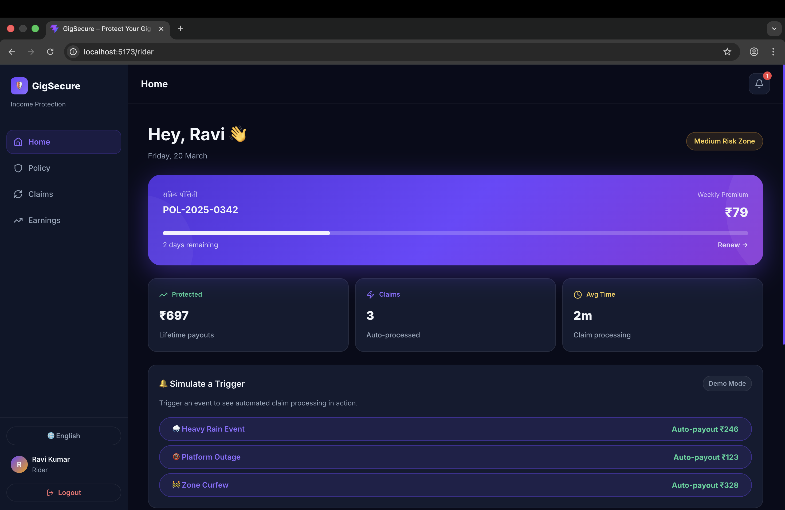
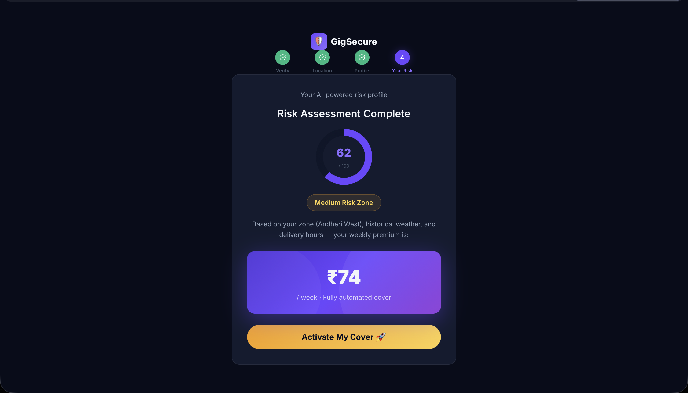
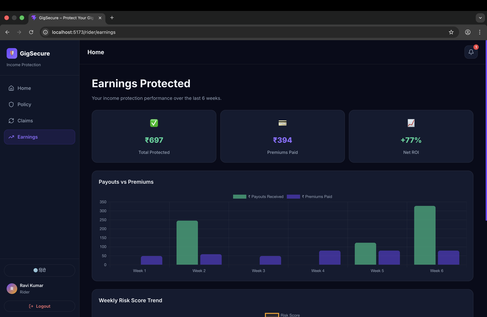
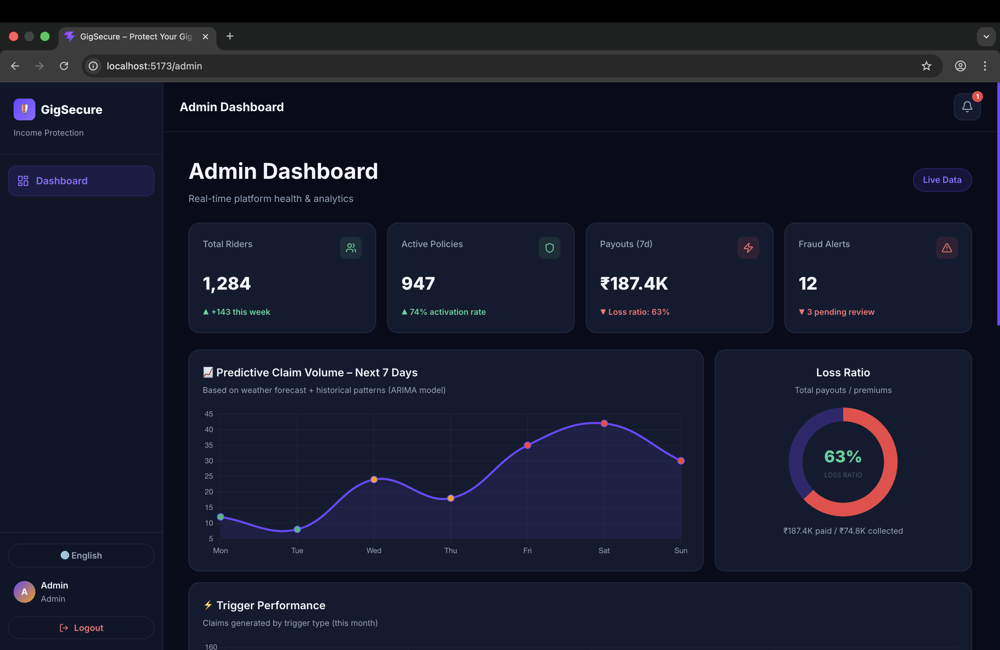

<div align="center">
  
  <h1>GigSecure</h1>
  <p><b>AI-Powered Parametric Income Protection strictly for Q-Commerce Gig Riders.</b></p>
  <p><i>Because 10-minute deliveries shouldn't mean 10-minute bankruptcies.</i></p>

  <br />

  [](https://github.com/TanmayK-23/GigSecure)
</div>

---

## Table of Contents

1. [Persona & Problem Statement](#persona--problem-statement)
2. [Proposed Solution (Detailed)](#proposed-solution-detailed)
3. [AI/ML Integration (Detailed)](#aiml-integration-detailed)
4. [Fraud Detection](#fraud-detection)
5. [Adversarial Defense & Anti-Spoofing Strategy](#adversarial-defense--anti-spoofing-strategy)
6. [System Architecture](#system-architecture)
7. [Tech Stack](#tech-stack)
8. [Running the Application Locally](#running-the-application-locally)
9. [Repository Structure](#repository-structure)
10. [6‑Week Development Roadmap](#6week-development-roadmap)
11. [Constraints Compliance](#constraints-compliance)
12. [Team Details](#team-details)

---

## Persona & Problem Statement

**Our Persona: The Q‑Commerce Rider**  
- **Who:** Grocery & food delivery partners operating on platforms like Zepto, Blinkit, Swiggy Instamart.  
- **Financial Reality:** Earns ₹700 – ₹1,200 daily. Cashflow is strictly week‑to‑week.  
- **Pain Points:** Highly vulnerable to uncontrolled external events – heavy rain, sudden curfews, platform outages – that can wipe out 30‑50% of their daily earnings in a single afternoon.  
- **Why Traditional Insurance Fails Them:**  
  - Premiums are monthly/annual (₹2,000+), too high for weekly budgets.  
  - Claim processes require documentation (e.g., proof of rain) and take weeks.  
  - No coverage for “lost income” – only accidents or hospitalisation.

**The Problem in One Sentence:**  
*No one protects the daily cash flow of gig workers from the unpredictable external disruptions that directly stop them from earning.*

---

## Proposed Solution

**GigSecure** is an AI‑powered **parametric** insurance platform built exclusively for Q‑Commerce delivery partners.

Instead of waiting for an accident and filing paperwork, GigSecure **automatically** monitors external data sources (weather APIs, platform health APIs, civic alert APIs). When a predefined disruption threshold is crossed in a rider’s active zone, the policy **triggers automatically**, and the rider receives an **instant payout** for lost income – with **zero claim filing** required.

### How It Works (Phase 1 Baseline)

1. **Onboarding & Risk Profiling**  
   - Rider signs up with phone number (OTP verification).  
   - Grants location permissions; system analyses last 7 days of location history to understand their primary zones and typical working hours.  
   - Rider provides basic info (vehicle type, average daily earnings).  
   - AI calculates a personalised **Risk Score** (0–100) based on zone historical disruptions, weather forecast, and rider’s working pattern.

2. **Weekly Policy Purchase**  
   - Dynamic weekly premium displayed: `Base + Zone Loading + Weather Loading`.  
   - Optional “Peak‑Hour Booster” for extra coverage during high‑earning hours (6‑9 PM).  
   - Rider pays via mock payment gateway (Razorpay test mode).  
   - Policy is active for 7 days.

3. **Parametric Monitoring & Auto‑Claim**  
   - System continuously listens to external APIs via a dedicated Trigger Engine.  
   - **Real-Time Synchronisation:** Uses `Socket.IO` to push instant claim alerts and payout confirmations to the rider's dashboard.
   - When a trigger condition is met (e.g., heavy rain in a zone for >30 min), it identifies all riders with active policies in that zone.  
   - Lost income is calculated as: `(rider’s average hourly earnings for that time slot) × (hours disrupted)`.  
   - A claim is created and payout is initiated **automatically** – rider receives a notification and the amount is credited.

4. **Analytics & Insights**  
   - Riders see “Earnings Protected” dashboard: total payouts vs. premiums paid.  
   - Admin dashboard shows loss ratio, **ARIMA-based predictive volume**, fraud alerts, and trigger performance.

### Key Modules (Phase 2 Implementations)

1. **Registration Process**  
   - **Seamless Onboarding:** Fast OTP-based mobile login designed for riders on the go, avoiding lengthy forms.
   - **Interactive Zone Selection:** Riders select from 5 distinct coverage zones (e.g. Andheri, Dharavi, Powai).
   - **Real-Time UX:** Features smooth stagger animations (`fadeUp`) for a premium onboarding experience.

2. **Insurance Policy Management**  
   - **Transparent Coverage:** Policies are active for exactly 7 days, tailored to the weekly gig economy cash flow. 
   - **Feature-Rich Dashboard:** Riders clearly see "Days Remaining", along with visual alerts when a policy approaches expiry (< 2 days).
   - **Shareable Proof:** Riders can instantly share a snapshot of their active policy coverage via a copy-to-clipboard modal.

3. **Dynamic Premium Calculation**  
   - **ML-Driven Risk Engine:** Uses `XGBoost` & local logic to assess base risk, weather factors (e.g. rain/heat), and vehicle type.
   - **Live Price Recalculation:** The UI updates instantly (debounced at 400ms) over websockets as the rider toggles their vehicle, zone, or adds "Peak Hour Boosters" — giving them total control and trust over their pricing.
   - **Transparent Breakdown:** Riders can see exactly what they're paying for (`Base ₹35 + Zone ₹10 + Weather ₹8 = ₹53`).

4. **Claims & Payout Lifecycle (Phase 3 Updates)**  
   - **Zero-Touch Automation:** A backend `node-cron` orchestrator polls mock environmental APIs (rainfall, curfew, heat, platform outage, floods).
   - **Robust Payout Engine:** Implemented a formal `processing` → `paid`/`rejected` lifecycle with idempotent guards.
   - **Hybrid Fraud Detection:** Combines XGBoost-style heuristics with an `Isolation Forest` ML model to catch GPS spoofers and syndicate attacks.
   - **Real-time Notifications:** Pushes instant notifications via `Socket.IO`. Upon payout, riders get immersive visual cues (flying coins CSS animation) and an auditory ping (WebAudio chord).
   - **Session Isolation:** Transitioned to `sessionStorage` for authentication, allowing Admin and Rider panels to run side-by-side in independent browser tabs.

### Parametric Triggers (Examples)

| Trigger | Data Source | Condition |
|---------|-------------|-----------|
| Heavy Rain | OpenWeatherMap API | Rainfall >25mm/h for ≥30 min in rider’s zone |
| Curfew / Zone Closure | Mock Civic Alerts API | Geo‑fenced area marked “closed” |
| Platform Outage | Mock Platform Health API | API returns `status: "outage"` for >15 min |

These triggers are designed to be **objective, verifiable, and fraud‑resistant** – no subjective human judgment needed.

---

## AI/ML Integration (Detailed)

GigSecure embeds machine learning at three critical layers, each serving a distinct business function.

### 1. Dynamic Risk Profiling (Underwriting)

- **Model:** Gradient Boosting (XGBoost)  
- **Input Features:**  
  - Rider’s historical claim frequency (if any)  
  - Average rainfall in last 7 days & forecast for next 7 days  
  - Zone‑specific “disruption hours” (historical data)  
  - Rider’s average active hours per day  
  - Vehicle type (EV vs. ICE – affects mobility during floods)  
- **Output:** Risk Score (0–100)  
- **Usage:** The risk score feeds directly into the premium formula:  
  `Weekly Premium = Base Rate × (1 + Risk Score/100) × Weather Multiplier`  
- **Training:** Initially on synthetically generated data representative of Q‑Commerce zones; continuously retrained as real policy and claim data becomes available.

### 2. ARIMA Predictive Claim Volume (Treasury Management)

- **Model:** AutoRegressive Integrated Moving Average (ARIMA) – a time‑series forecasting model  
- **Input:** Historical daily claim volumes and 7‑day weather forecasts (temperature, rainfall, wind)  
- **Output:** Forecast of total claim volume for the next 7 days  
- **Usage:** Admin dashboard displays predicted claim spikes, allowing the platform to:  
  - Adjust premium pricing dynamically for new policies (surge pricing)  
  - Manage treasury liquidity to ensure instant payouts

- **Model:** Unsupervised Isolation Forest (Python Scikit-Learn)
- **Features:** Max speed between pings, altitude variance (z-axis), gyroscope variance, concurrent claims, and weather data mismatch.  
- **Output:** Anomaly Score (0–1)  
- **Usage:** Fraudulent attempts (like GPS spoofing or emulator-based syndicate attacks) are automatically flagged for Admin review. Rejected claims instantly trigger a "Claim Rejected" alert on the Rider's dashboard via WebSockets.

---

## App Screenshots

*Showcasing the Phase 1 Demo MVP running locally.*

<div align="center">
  <table>
    <tr>
      <td align="center"><b>Rider Dashboard</b><br>(Active Policy & Recent Payouts)</td>
      <td align="center"><b>AI Risk Profiling</b><br>(Dynamic Rating & Quoting)</td>
    </tr>
    <tr>
      <td></td>
      <td></td>
    </tr>
    <tr>
      <td align="center"><b>Earnings Protected</b><br>(Chart.js Data Viz)</td>
      <td align="center"><b>Admin Command Center</b><br>(Fraud Alerts & ARIMA Forecast)</td>
    </tr>
    <tr>
      <td></td>
      <td></td>
    </tr>
  </table>
</div>

---

## Fraud Detection

Parametric insurance can be vulnerable to opportunistic behaviour. GigSecure implements a multi‑layered fraud detection system to protect the pool and ensure fair payouts.

1. **GPS Spoofing Detection (Baseline)**  
   - *Method:* Analyse consecutive location points. If the calculated speed exceeds a realistic threshold (e.g., 50 km in 3 minutes), the claim is marked suspicious.  
   - *Mitigation:* Flagged claims appear in admin queue; auto‑payout withheld.

2. **Fake Weather Claims**  
   - *Method:* Cross‑reference claim time and zone with a secondary weather data source (mock or real) to verify that the claimed trigger actually occurred.  
   - *Mitigation:* Mismatched data triggers manual review.

3. **Duplicate Claim Prevention**  
   - *Method:* Check for identical rider, same trigger type, same time window, and same event ID.  
   - *Mitigation:* Duplicates are automatically rejected, and the rider receives a notification explaining the rejection.

4. **Pattern‑of‑Life Analysis**  
   - *Method:* Compare rider’s historical activity (hours worked, zones frequented) against their behaviour during the claimed disruption.  
   - *Mitigation:* If a rider appears only during high‑risk events (e.g., logs in only when it starts raining), their future claims may be subject to higher scrutiny.

All fraud flags are visualised in the **Admin Dashboard** with options to approve, reject, or suspend user accounts.

---

### Adversarial Defense & Anti-Spoofing Strategy

With the rise of coordinated syndicates using advanced GPS-spoofing to drain liquidity pools, basic geospatial fences are obsolete. GigSecure defends the treasury using an **Unsupervised Isolation Forest** anomaly detection model combined with granular device telemetry.

#### 1. The Differentiation: Spoofing vs. Genuine Disruption
A real delivery partner trapped in a red-alert storm exhibits erratic micro-movements (seeking shelter) and fading signal strength as severe weather disrupts cell towers. A bad actor lounging at home using a GPS spoofer typically transmits mathematically perfect, rigidly stationary coordinates or "robotic" linear trajectories into the storm zone. Our ML model identifies these inorganic coordinate clusters and flags them instantly.

#### 2. The Data: Beyond Basic Coordinates
To defeat localized spoofing rings, our Trigger Engine ingests a multi-dimensional telemetry vector instead of just lat/long coordinates:
- **Timestamp Velocity (The Physics Check):** We calculate the time-distance delta. A ping jumping 15km into a rain zone in 4 seconds is an impossible velocity anomaly.
- **Altitude Consistency (Z-Axis):** Basic spoofers often lock altitude to `0` or a static number. We cross-reference the Z-axis against local topography.
- **Gyroscopic & Accelerometer Variance:** Authentic riders in a storm generate micro-shifts (shivers, phone handling). Spoofed devices report synthetic, static sensor profiles.
- **Pattern-of-Life Syndicate Matching:** If 500 devices suddenly converge on a single localized grid precisely 2 minutes after a weather alert, the model flags the highly coordinated timing as a syndicate attack.

#### 3. The UX Balance: Protecting Honest Riders
GigSecure operates on a "Trust, but Verify asynchronously" mechanism so honest workers experiencing genuine network drops aren't unfairly punished:
- **Soft-Flagging:** If an Anomaly Score crosses the threshold, the claim is NOT rejected. It enters a `PENDING_REVIEW` state rather than auto-paying.
- **Grace Period & Asynchronous Proof:** The flagged rider receives a notification about a "security delay" and is requested to submit a quick 5-second live camera pan or a final delivery screenshot when their network stabilizes.
- **Trust Score Routing:** Riders with a historically strong, verified track record (high trust score generated during Onboarding risk profiling) bypass initial strict filters, minimizing friction for our most loyal users.

---

## System Architecture

GigSecure is built as a decoupled, scalable system with clear separation of concerns.

```
┌─────────────────┐      ┌─────────────────┐      ┌─────────────────┐
│   React PWA     │ ───► │   Node.js API   │ ───► │   PostgreSQL    │
│  (Frontend)     │ ◄─── │   (Backend)     │ ◄─── │   (Users, Pol.) │
└─────────────────┘      └────────┬────────┘      └─────────────────┘
                                  │
                                  ▼
                         ┌─────────────────┐
                         │   Redis Cache   │
                         │ (Sessions, Trig)│
                         └─────────────────┘
                                  │
                                  ▼
┌─────────────────┐      ┌─────────────────┐      ┌─────────────────┐
│   External      │ ───► │   Python ML     │ ───► │   MongoDB       │
│   APIs          │      │   Microservice  │      │ (Location Logs) │
└─────────────────┘      └─────────────────┘      └─────────────────┘
```

### Component Descriptions

- **Frontend (React PWA):** Mobile‑first, installable on phones. Uses Chart.js for dashboards, Axios for API calls.  
- **Backend (Node.js + Express):** RESTful API handling auth, policy management, trigger ingestion, and claim orchestration.  
- **Database:** PostgreSQL for structured data (users, policies, claims); MongoDB for time‑series location data.  
- **ML Microservice (Python Flask):** Hosts trained models and exposes endpoints for risk scoring, fraud scoring, and claim volume forecasting.  
- **Cache (Redis):** Stores active trigger states, user sessions, and temporary data for low‑latency checks.  
- **External APIs:** OpenWeatherMap (free tier), Mock Civic Alerts (simulated), Mock Platform Health (simulated).

---

## Tech Stack

| Layer | Technology | Purpose |
|-------|------------|---------|
| **Frontend** | React + Vite + PWA | Mobile‑optimised web app with offline capability and push notifications. |
| **Backend** | Node.js + Express.js | REST API server, business logic, trigger engine. |
| **Database (Primary)** | PostgreSQL | Users, policies, claims, transactions. |
| **Database (Time‑Series)** | MongoDB | Location logs, event streams. |
| **AI/ML** | Python (Flask, scikit‑learn, pandas) | Hosts XGBoost risk model, Isolation Forest, ARIMA. |
| **Cache** | Redis | Session management, trigger state. |
| **Payments** | Razorpay Test Mode | Simulated instant payouts. |
| **External APIs** | OpenWeatherMap, Mock Civic Alerts, Mock Platform Health | Parametric data sources. |
| **Hosting** | Vercel (frontend) + Heroku/AWS (backend) | Demo deployment. |

---

## 💻 Running the Application Locally

```bash
# 1. Start the ML Service
cd ml
pip install -r requirements.txt
flask --app app run --port 5001

# 2. Start the Backend API
cd backend
npm install
node server.js
# Runs on port 4000

# 3. Start the Frontend PWA
cd frontend
npm install
npm run dev
# Runs on port 5173
```

> **Demo Note:**  
> - Use phone number `9876543210` and OTP `123456` to log in as a rider.  
> - Click "Admin Login" on the landing page to access the Command Center.  
> - The "Simulate Trigger Event" buttons on the Rider Dashboard let you test the parametric flow instantly.

---

## 📁 Repository Structure

```
gigsecure/
├── frontend/            # React PWA (Vite)
│   ├── src/             # Pages, Components, Contexts, Utils
│   └── public/          # Manifest & Icons
├── backend/             # Node.js + Express API
│   ├── routes/          # Auth, Policies, Triggers, Admin, Claims
│   ├── mocks/           # In-memory data store for MVP
│   ├── app.js           # Express App Setup
│   └── server.js        # Entry point
├── ml/                  # Python ML microservice
│   ├── app.py           # Flask endpoints (XGBoost, Isolation Forest, ARIMA)
│   └── requirements.txt # Python dependencies
└── README.md            # You are here
```

---

## 6‑Week Development Roadmap

### Phase 1: Foundation (Weeks 1‑2)
*Theme: “Ideate & Know Your Delivery Worker”*

- **Research & Persona Validation:** Finalise rider persona, map out user journeys.  
- **GitHub Setup:** Create repository with this README as the core documentation.  
- **Prototype UI:** Basic React PWA scaffolding, mobile‑first navigation, OTP mock login.  
- **Weather API Integration:** Fetch real‑time weather data for demo zones.  
- **Risk Profile Mock ML:** Simple rule‑based risk score (to be replaced later).  
- **Deliverables:**  
  - README (this document) in GitHub.  
  - 2‑min demo video showing registration and risk profile.

### Phase 2: Core Features (Weeks 3‑4)
*Theme: “Protect Your Worker”*

- **Backend Development:**  
  - User registration & auth (JWT).  
  - Policy schema, purchase endpoint, premium calculation logic.  
  - Claim creation and payout simulation.  
- **Trigger Engine:** Implement webhook listener for weather, curfew, and outage events.  
- **Frontend Features:**  
  - Policy purchase flow with dynamic premium display.  
  - Rider dashboard (active policy, claims history).  
  - Admin dashboard skeleton.  
- **AI/ML:**  
  - Train XGBoost model on mock data and integrate as Flask endpoint.  
  - Implement basic claim value prediction for payouts.  
- **Deliverables:**  
  - Functional app with registration, policy purchase, automated claim on mock trigger, and payout.  
  - 2‑min demo video showcasing the end‑to‑end flow.

### Phase 3: Scale & Optimise (Weeks 5‑6) [COMPLETED]
*Theme: “Perfect for Your Worker”*

- **Advanced Fraud Detection:**  
  - **Deployed Isolation Forest** model on the Python ML service.
  - Added multi-factor telemetry checks (GPS velocity, Altitude stability, Gyro variance).
  - Implemented **Zone-wise filtering** in the Admin Fraud Pipeline.
- **Robust State Management:**  
  - Fixed "State Bleed" by switching to `sessionStorage` for Auth, enabling side-by-side demoing.
  - Implemented `localStorage` persistence for Policy state to survive refreshes.
- **Enhanced UX & Real-time Sync:**  
  - Integrated `Socket.IO` events for `claim_rejected` and `payout_credited`.
  - Added "Idempotent guards" to prevent duplicate toasts or multiple notifications for the same event.
- **Final Deliverables:**  
  - [x] 5‑min demo video (trigger → auto‑claim → payout + fraud detection demo).  
  - [x] Final pitch deck (PDF) covering persona, AI architecture, business viability.  
  - [x] Source code with all Phase 3 optimizations working.

---

## Constraints Compliance

| Constraint | GigSecure Compliance |
|-----------|---------------------|
| No health insurance coverage | Strictly excluded |
| No life insurance coverage | Strictly excluded |
| No accident/medical bill coverage | Strictly excluded |
| No vehicle repair coverage | Strictly excluded |
| Weekly pricing model | All plans priced and structured weekly |
| Income loss only | All payouts calculated as lost hourly/daily earnings |
| Delivery persona focus | Q-commerce & multi-platform delivery partners operating across Zepto, Blinkit, Swiggy, Zomato, and similar platforms |

---

## Team Details

| Name | Role | Responsibilities |
|------|------|------------------|
| [Kushagra Srivastava] | Project Lead | Architecture, API integration, overall coordination |
| [Tanmay Kumar] | AI/ML Engineer | Generative AI & XGBoost/ARIMA modeling |
| [Anshul Pagar] | Backend Developer | Node.js API, trigger engine, database design |
| [CS Ganeshan] | Frontend Developer | React PWA, User Experience (UX), dashboard implementation |
| [Aditi Thakur] | Product & UI/UX Designer | UI design tokens, research, and presentation |

*All team members contribute to ideation, testing, and documentation.*

---

**GigSecure** – *Because your livelihood shouldn’t be a gamble.*